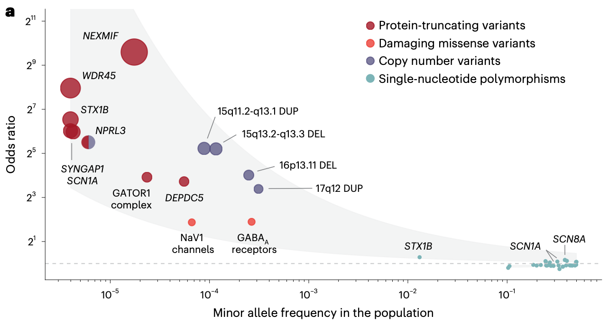

“Exome sequencing of 20,979 individuals with epilepsy reveals shared and distinct ultra-rare genetic risk across disorder subtypes” from the Epi25 Collaborative now published in *Nature Neuroscience*
<!--more-->

Back in 2019, we published a whole-exome sequencing (WES) study of epilepsy as part of the Epi25 Collaborative that revealed shared and distinct burden of ultra-rare deleterious variants (URVs) across severe and less severe epilepsy subtypes and highlighted a ubiquitous role for defects in GABAergic inhibition. Built upon the previous work, a larger WES from Epi25 published this year further nominated potential novel risk genes, with an enriched role in synaptic transmission and neuronal excitability. Along with URV burden observed in gene sets and copy number variations, these findings map out an expanded genetic architecture of epilepsy, highlighting a convergence of different genetic risk factors within the same genes. 

Reference:  
Epi25 Collaborative. (Feng et al. 2019) Ultra-Rare Genetic Variation in the Epilepsies: A Whole-Exome Sequencing Study of 17,606 Individuals. *American Journal of Human Genetics,* 105(2), 267-282.  
Epi25 Collaborative. (Chen et al. 2024) Exome sequencing of 20,979 individuals with epilepsy reveals shared and distinct ultra-rare genetic risk across disorder subtypes. *Nature Neuroscience,* 27 (10), 1864-1879.

